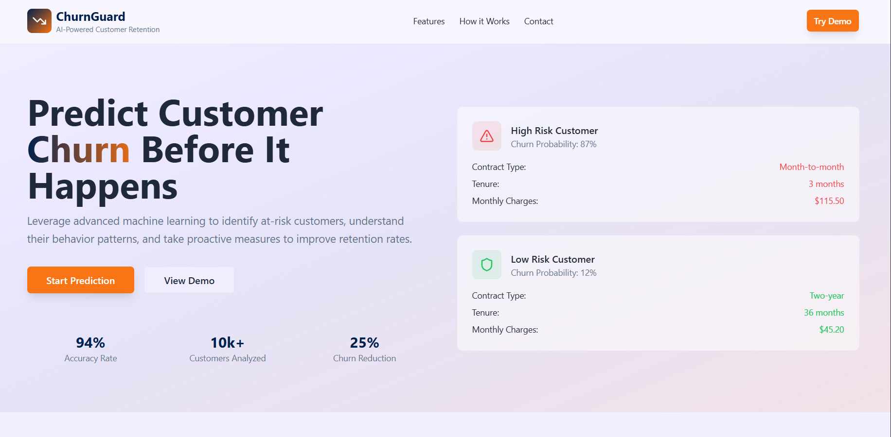

# Churn Guard




A modern, responsive web application for churn prediction.

## Live Demo

[Churn Guard Live](https://churn-guard01.netlify.app/)

## Features
- Predict customer churn with an intuitive UI
- Mobile responsive design
- Built with React, TypeScript, Tailwind CSS

## Getting Started

1. Clone the repository:
   ```sh
   git clone https://github.com/jhasachin02/Churn-Prediction.git
   cd Churn-Prediction
   ```
2. Install dependencies:
   ```sh
   npm install
   ```
3. Start the development server:
   ```sh
   npm run dev
   ```

## Project Structure
- `src/` — Main source code (components, pages, hooks, styles)
- `public/` — Static assets (favicon, images)
- `index.html` — Main HTML file

## License

MIT

